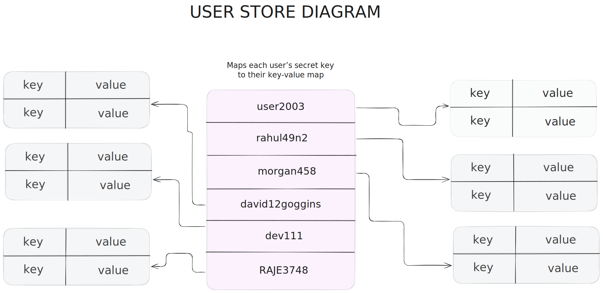
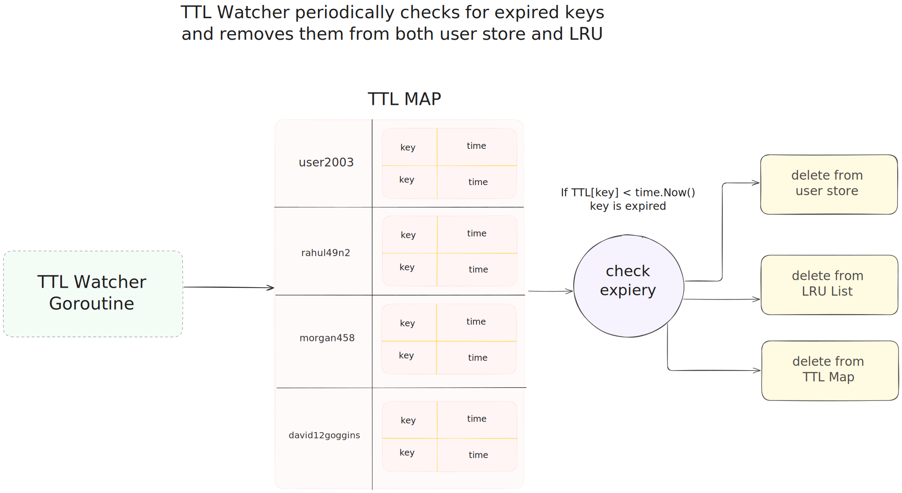
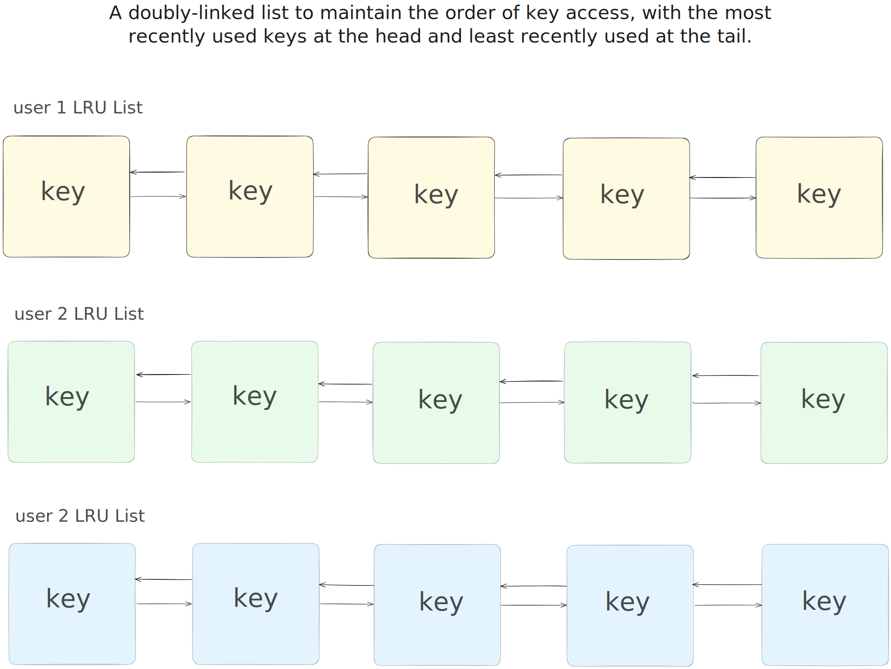

# AtomDB 🚀

**AtomDB** is a Redis‑compatible, in‑memory key‑value database written in Go.  
It’s designed as a learning project and demonstrates how a simple database server works under the hood.

---

## 🔎 Table of Contents

1. [Why AtomDB?](#why-atomdb)  
2. [Features](#features)  
3. [Getting Started](#getting-started)  
4. [Core Components](#core-components)  
   - [1. TCP Server (`server.go`)](#1-tcp-server-servergo)  
   - [2. RESP Parser (`parser.go`)](#2-resp-parser-parsergo)  
   - [3. Command Router (`route.go`)](#3-command-router-routego)  
   - [4. In‑Memory Store (`store.go`)](#4-in‑memory-store-storego)  
   - [5. TTL Expiry (`ttl.go`)](#5-ttl-expiry-ttlgo)  
   - [6. LRU Eviction (`lru.go`)](#6-lru-eviction-lrugo)  
5. [Data Structures](#data-structures)  
6. [How Commands Work (Example)](#how-commands-work-example)  
7. [Diagrams](#diagrams)  
8. [Future Improvements](#future-improvements)  
9. [License](#license)

## Why AtomDB?

I built AtomDB to learn:

- How Redis’s RESP protocol works  
- Basic TCP servers in Go with concurrent clients  
- Simple caching (LRU) and expiry (TTL) logic  
- Thread‑safe in‑memory storage  


## Features

- 🔐 **AUTH**: per‑user secret key  
- 💾 **SET / GET**: store and retrieve strings  
- ⏲️ **EXPIRE**: set key time‑to‑live  
- ♻️ **LRU**: evict least‑recently‑used keys when >30  
- ⚡ **RESP protocol**: same wire format as Redis  
- 🧵 **Concurrency**: goroutines + mutexes


## Getting Started

1. **Clone Repo**

   ```bash
   git clone https://github.com/your-user/atomdb.git
   cd atomdb
   ```
2. **Run the server**

   ```bash
   go run server.go
   ```
3. **Connect with Redis CLI**

   ```bash
   redis-cli -p 8080
   ```
4. **Authenticate**

   ```bash
   AUTH mySecret123
   ```

## Core Components

### 1. TCP Server (`server.go`)

* Listens on port (default `:6300`)
* Accepts connections, spawns a goroutine per client
* Tracks each client in a `client` struct:

  ```go
  type client struct {
    conn            net.Conn      // network socket
    reader          *bufio.Reader // RESP reader
    isAuthenticated bool           // auth flag
    remoteAddr      string         // client address
    secretKey       string         // user’s secret key
    LRU             *LRUList       // per‑user LRU cache
  }
  ```
* Starts a background TTL watcher
* Main loop:

  1. Read raw RESP bytes
  2. Parse into `[]string`
  3. If not authenticated → only `AUTH` allowed
  4. Else → pass to `HandleCommand`

  ---

### 2. RESP Parser (`parser.go`)

Parses Redis Serialization Protocol:

```go
func ReadRESP(reader *bufio.Reader) ([]byte, error) { … }
func RespParsing(input []byte) ([]string, error) { … }
```

* Reads `*<count> ` header
* For each item, reads `$<len> ` then payload
* Returns slice like `["SET","name","Alice"]`

---

### 3. Command Router (`route.go`)

Routes commands based on first token:

```go
switch cmd {
case "SET":
  SetKey(...)
case "GET":
  GetKey(...)
case "EXPIRE":
  SetTTL(...)
default:
  ERR unknown command
}
```

* Checks argument count
* Sends Redis‑style replies:

  * `+OK `
  * \`-\$len

\`

* `-ERR <message> `

---

### 4. In‑Memory Store (`store.go`)

Global map:

```go
var globalStore = map[string]map[string]string{}
// secretKey → (key → value)
```

* **SetKey**:

  * Locks with `mut.Lock()`
  * Creates user map if missing
  * Updates value
  * Calls `AddNode` on LRU
* **GetKey**:

  * RLocks with `mut.RLock()`
  * Reads value
  * Calls `RecentlyUsed` on LRU

---

### 5. TTL Expiry (`ttl.go`)

Tracks expirations:

```go
var TTLmap = map[string]map[string]time.Time{}
// secretKey → (key → expiryTime)
```

* **SetTTL**: parse seconds, store expiry
* **TTLWatcher**:

  * Runs every second
  * Locks TTL and store
  * Deletes expired keys from `globalStore` and LRU
  * Unlocks

---

### 6. LRU Eviction (`lru.go`)

Per‑user LRU cache:

```go
type Node struct {
  prev, next *Node
  key        string
}
type LRUList struct {
  head, tail *Node
  count      int
  LRUnodeMap map[string]*Node
}
```

* **AddNode**:

  * If count ≥30: remove `tail` (delete from store)
  * Insert new node at `head`
* **RecentlyUsed**: move accessed node to `head`
* **RemoveNode**: remove node when TTL fires


## Data Structures

### User Store


| Feature     | Go Type                                 | Purpose                      |
| ----------- | --------------------------------------- | ---------------------------- |
| User Store  | `map[string]map[string]string`          | Store data per `secretKey`   |

The User Store is a nested map structure that organizes data by user authentication secrets. Each user (identified by their `secretKey`) has their own isolated key-value store. This provides data isolation between different clients connecting to the server. The implementation uses a global variable `globalStore` protected by a mutex for thread-safe concurrent access.


### TTL Tracker


| Feature     | Go Type                                 | Purpose                      |
| ----------- | --------------------------------------- | ---------------------------- |
| TTL Tracker | `map[string]map[string]time.Time`       | Track key expirations        |

The TTL Tracker maintains expiration times for keys. It uses a nested map structure similar to the User Store, where each user's keys are mapped to their expiration timestamps. A background goroutine (`TTLWatcher`) periodically checks for expired keys and removes them from both the User Store and the LRU Cache. This implements Redis-like key expiration functionality.

### LRU Cache


| Feature     | Go Type                                 | Purpose                      |
| ----------- | --------------------------------------- | ---------------------------- |
| LRU Cache   | Doubly linked list + `map[string]*Node` | O(1) eviction operations     |

The LRU (Least Recently Used) Cache implements an efficient memory management strategy. It uses a doubly-linked list to maintain the order of key access, with the most recently used keys at the head and least recently used at the tail. A map provides O(1) lookups to list nodes. When memory limits are reached (count ≥ 30), the least recently used keys are evicted. The implementation includes operations for adding nodes, marking nodes as recently used, and removing nodes when keys expire.

### Synchronization

| Feature     | Go Type                                 | Purpose                      |
| ----------- | --------------------------------------- | ---------------------------- |
| Sync        | `sync.RWMutex`                          | Safe concurrent access       |

Mutexes ensure thread-safe access to shared data structures. The implementation uses read-write mutexes (`sync.RWMutex`) to allow concurrent reads but exclusive writes, optimizing performance while maintaining data consistency in a multi-client environment.